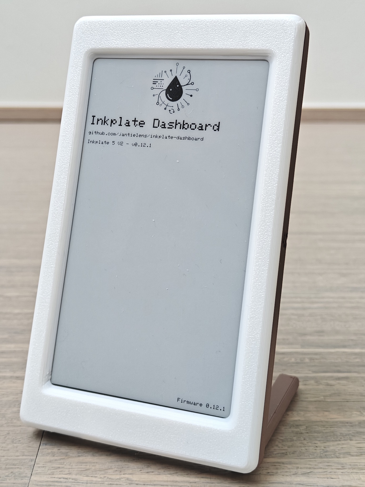

# Inkplate Dashboard
A smart, multi-board firmware for [Inkplate e-ink displays by Soldered Electronics](https://www.soldered.com/categories/inkplate/) that transforms your device into a beautiful, always-on dashboard. Effortlessly download and display custom images from any web URL, with easy WiFi setup, web-based configuration, and power-saving features. Perfect for Home Assistant users, digital signage, and battery-powered displays—just set it up and enjoy a personalized, glanceable dashboard that updates itself automatically.

## Features

- 📶 **Easy WiFi setup** via captive portal, including support for static IP configuration
- 🖼️ **Multi-image carousel** support (1-10 images with individual display intervals)
- 🔄 **Configurable screen rotation** (portrait/landscape)
- 🔋 **Power efficient**: deep sleep between updates
- 🌐 **Web-based configuration** and OTA firmware updates
- 🔘 **Button controls** for config mode and manual refresh
- 🏠 **Home Assistant integration** (optional MQTT battery reporting)
- ⚡ **Advanced options**: CRC32-based battery saver, flexible hourly scheduling, VCOM management, and more

  <table>
    <tr>
      <th style="min-width:260px;">Splashscreen during first boot</th>
      <th style="min-width:220px;">Config Portal in brower</th>
    </tr>
    <tr>
      <td style="vertical-align:top; text-align:center;">
         
      </td>
      <td style="vertical-align:top; text-align:center;">
         
      </td>
    </tr>
  </table>

## Supported Devices

- **Inkplate 5 V2**
- **Inkplate 2**
- **Inkplate 6 Flick**
- **Inkplate 10** *(not tested on hardware)*

> **Note:** Inkplate 10 is not tested on real hardware, as I do not own all Inkplate boards. If you have an untested or unsupported device and want to help test or ensure support: please [create an issue](https://github.com/jantielens/inkplate-dashboard/issues) or open a discussion!

## Getting started
1. Connect your Inkplate device to your computer via USB.
2. Flash the firmware using one of these methods:
	
	**Option A: Web-based flasher (recommended)**
	- Visit [https://jantielens.github.io/inkplate-dashboard/](https://jantielens.github.io/inkplate-dashboard/)
	- Select your Inkplate model and click "Connect" to flash directly from your browser
	- No downloads or additional software required!
	
	**Option B: Manual flashing**
	- Download firmware from [GitHub Releases](https://github.com/jantielens/inkplate-dashboard/releases) and flash using [ESPHome Flasher](https://github.com/esphome/esphome-flasher) or similar tools
3. Power on your device. The onboarding flow has two steps:
	- **Step 1: WiFi Setup (AP Mode)** – On first boot, the device creates a WiFi access point. Connect to it and enter your WiFi credentials in the browser.
	- **Step 2: Dashboard Configuration (Config Mode)** – After joining your WiFi, the device automatically enters config mode. Access the device's IP in your browser to configure your image(s) with display intervals (1 image for single mode, 2+ for carousel).
	The device will guide you through each step directly on the screen.
5. Enjoy your personalized, always-on dashboard!

## Documentation

- User documentation is available in the [docs/user/README.md](docs/user/README.md) file.
- Developer documentation can be found in the [docs/dev/README.md](docs/dev/README.md) file.

## Credits

- Built with [Arduino CLI](https://arduino.github.io/arduino-cli/)
- Uses [Inkplate Library](https://github.com/SolderedElectronics/Inkplate-Arduino-library)
- For [Inkplate Devices](https://www.soldered.com/categories/inkplate/) by Soldered Electronics
