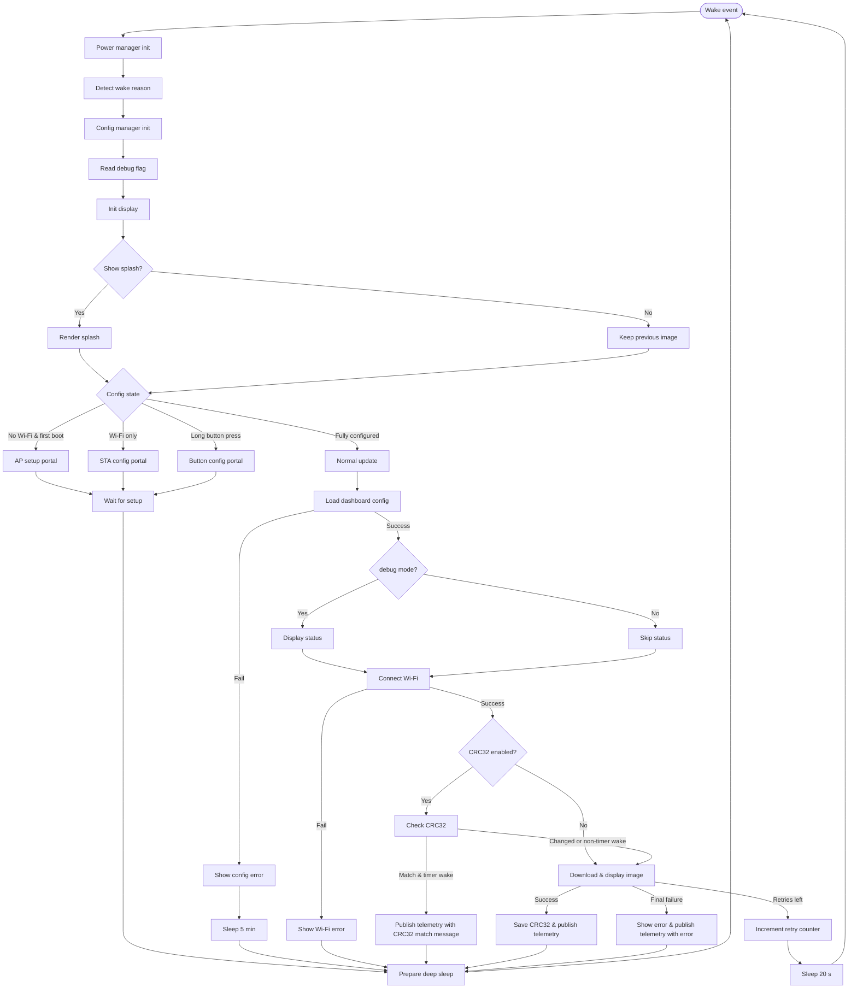

# Display Cycle Overview

This guide explains the runtime flow the Inkplate dashboard follows after a wake event, and how the different modes interact. It complements the inline comments in `common/src/main_sketch.ino.inc`.

## 1. Setup Phase

1. **Serial & power initialization** – `setup()` configures the `PowerManager` before anything else so we can interrogate the wake reason.
2. **Config manager** – Preferences storage is opened early for configuration loading.
3. **Display splash policy** – The screen is only cleared and the splash shown when:
   - The wake reason is `WAKEUP_FIRST_BOOT`
   On timer wakes, the previous image remains visible until the new one is ready.

## 2. Mode Selection

After setup the firmware branches according to configuration state and wake reason:

- **AP (boot) mode** – Triggered if no Wi-Fi credentials exist and the device just booted (`WAKEUP_FIRST_BOOT`). The ESP32 starts its own AP and shows onboarding instructions.
- **Auto config (Step 2)** – Wi-Fi credentials exist but no image URL. The device connects to Wi-Fi as a station, launches the portal, and guides the user through completing configuration.
- **Button-triggered config** – A long button press on wake forces config mode (with MQTT logging if configured). Short presses on button wakes initiate an immediate normal update.
- **Normal operation** – Any fully configured wake with no override runs `performNormalUpdate()`.

## 3. Normal Update Pipeline

1. **Load configuration** – Fails fast if preferences cannot be retrieved.
2. **Minimal status UI** – The device stays silent during normal operation until the final outcome (image or error). Only essential screens are shown (setup instructions, errors, manual refresh confirmation).
3. **Collect telemetry data** – Battery voltage and wake reason are collected early, before WiFi connection.
4. **Wi-Fi connection** – Attempts to associate using stored credentials. On success RSSI is captured for MQTT telemetry.
5. **CRC32 check (optional)** – If enabled, checks if image has changed:
   - On timer wake with matching CRC32: Skip image download, publish telemetry with "unchanged" message, and sleep immediately.
   - On button wake or CRC32 change: Continue to image download.
6. **Download & display** – `ImageManager::downloadAndDisplay()` streams the image (PNG or baseline JPEG) directly to the Inkplate. Success resets the retry counter and saves the new CRC32 (if enabled).
7. **MQTT telemetry (single session)** – If MQTT is configured, a single session publishes all data at once:
   - **Discovery messages** (conditional): Published only on first boot and hardware reset, skipped on normal timer wakes.
   - **State messages**: Battery voltage, battery percentage, WiFi signal, WiFi BSSID, loop time (total), loop time breakdown (WiFi, NTP, CRC, Image), image CRC32, and optional log message.
   - Loop time breakdown sensors help diagnose bottlenecks (0.00s = skipped operation).
   - All publishing happens at the end of the cycle, after image display.
8. **Deep sleep** – Device enters deep sleep for the configured refresh interval.

## 4. Error and Retry Handling

- **Image retrieval failures**:
  - Up to two retries are scheduled by writing `imageRetryCount` to RTC memory and entering a 20-second deep sleep. Messages are only drawn when debug mode is on or the failure is final.
  - After the third failure a detailed error screen (debug only) is shown, MQTT logs are emitted if available, and the device sleeps until the normal refresh window.
- **Wi-Fi failures** – Without a network connection the device cannot retry immediately; it prints a diagnostic screen (debug mode) and sleeps until the refresh interval to try again.

## 5. Configuration Modes

- **Boot AP** – Displays a step-by-step guide for first-time setup, starts the portal in `BOOT_MODE`, and reboots when credentials are submitted.
- **Station portal** – Used for both auto Step 2 and manual config. Shows the IP address to browse and enforces a two-minute timeout (except when onboarding).
- **Fallback AP** – If the station portal cannot connect, the device falls back to AP mode even mid-configuration to keep the user experience consistent.

All config flows publish MQTT log entries when MQTT credentials are valid (e.g., “Config mode entered”, “Settings updated”).

## 6. Minimal UI Design

The device minimizes e-ink refreshes during normal operation:

- Splash screen only shows on first boot
- No intermediate progress screens during image download
- Only essential screens are shown (setup instructions, errors, manual refresh acknowledgment)
- Serial logging is always available for diagnostics
