# Normal Mode Execution Flow

**Last Updated:** v1.5.2 (November 15, 2025)

This document provides comprehensive documentation of the normal mode controller's execution flow, decision logic, and implementation details. Normal mode is the primary operating mode where the device displays images on a schedule.

## Overview

The normal mode controller (`normal_mode_controller.cpp`) orchestrates the complete image display lifecycle:

1. **Configuration** - Load device and image settings
2. **Connectivity** - Connect to WiFi and sync time
3. **Scheduling** - Check hourly schedule constraints
4. **Image Selection** - Determine target image (carousel advancement)
5. **Optimization** - CRC32 check to skip redundant downloads
6. **Download & Display** - Fetch and render the image
7. **Error Handling** - Retry logic for failures
8. **Sleep Management** - Calculate and enter deep sleep

**Complexity Stats:**
- **Execution Paths**: 40+ unique combinations
- **Decision Variables**: 7+ interacting conditions
- **Code Organization**: ~190 lines of logic + 60-line truth table
- **Maximum Nesting**: 2 levels (down from 5 in earlier versions)

## Architecture

### Design Principles

The normal mode controller follows these core principles:

1. **Separation of Concerns** - Decision logic separated from orchestration
2. **Single Responsibility** - Each function makes one type of decision
3. **Testability** - Decision functions are pure and stateless
4. **Readability** - Main flow is high-level orchestration
5. **Documentation** - Truth table + flowchart ensure all paths are understood

### Decision-Based Architecture

The controller uses three pure decision functions that return structured results:

```cpp
struct ImageTargetDecision {
    uint8_t targetIndex;        // Which image to display (0-9)
    bool shouldAdvance;         // Should advance to next image after display
    const char* reason;         // Human-readable reason for this decision
};

struct CRC32Decision {
    bool shouldCheck;           // Check CRC32 and potentially skip download
    const char* reason;         // Human-readable reason for this decision
};

struct SleepDecision {
    float sleepSeconds;         // How long to sleep (0 = indefinite/button-only)
    const char* reason;         // Human-readable reason for this duration
};
```

Each decision function is **pure** (no side effects), **stateless** (output depends only on inputs), and **testable** (can be validated independently).

## Execution Flow

```mermaid
flowchart TD
    Start([Normal Mode Execute]) --> LoadConfig[Load Configuration]
    LoadConfig --> |Failed| ConfigError[Show Config Error<br/>Sleep 5 min]
    LoadConfig --> |Success| Telemetry[Collect Telemetry Data]
    
    Telemetry --> WiFi[Connect to WiFi]
    WiFi --> |Failed| WiFiError[Show WiFi Error<br/>Sleep 1 min]
    WiFi --> |Success| NTP{All Hours<br/>Enabled?}
    
    NTP --> |Yes| SkipNTP[Skip NTP Sync]
    NTP --> |No| DoNTP[Sync NTP Time]
    SkipNTP --> HourlyCheck
    DoNTP --> HourlyCheck
    
    HourlyCheck{Timer Wake?} --> |No| ImageTarget
    HourlyCheck --> |Yes| CheckHour{Hour<br/>Enabled?}
    CheckHour --> |No| SleepHourly[Sleep Until<br/>Next Enabled Hour]
    CheckHour --> |Yes| ImageTarget
    
    ImageTarget[Determine Image Target<br/>determineImageTarget] --> UpdateIndex{Should<br/>Advance?}
    UpdateIndex --> |Yes| AdvanceIdx[Update imageStateIndex]
    UpdateIndex --> |No| KeepIdx[Keep Current Index]
    AdvanceIdx --> CRC32Dec
    KeepIdx --> CRC32Dec
    
    CRC32Dec[Determine CRC32 Action<br/>determineCRC32Action] --> CRCEnabled{CRC32<br/>Enabled?}
    CRCEnabled --> |No| Download
    CRCEnabled --> |Yes| FetchCRC[Fetch CRC32<br/>Always when enabled]
    
    FetchCRC --> CheckSkip{Should<br/>Check?}
    CheckSkip --> |No| Download
    CheckSkip --> |Yes| CRCResult{CRC32<br/>Matched?}
    
    CRCResult --> |Yes & Timer| SkipDownload[Publish MQTT<br/>Sleep with Interval]
    CRCResult --> |No| Download
    
    Download[Download & Display Image] --> Result{Success?}
    
    Result --> |Success| SaveCRC{CRC32<br/>Changed?}
    SaveCRC --> |Yes| SaveIt[Save New CRC32]
    SaveCRC --> |No| SkipSave[Skip Save]
    SaveIt --> Frontlight
    SkipSave --> Frontlight
    
    Frontlight{Button Wake<br/>& Frontlight?} --> |Yes| TurnOnFL[Turn On Frontlight]
    Frontlight --> |No| PublishSuccess
    TurnOnFL --> PublishSuccess
    
    PublishSuccess[Publish Success MQTT] --> SleepSuccess[Calculate Sleep<br/>determineSleepDuration<br/>Enter Deep Sleep]
    
    Result --> |Failure| ModeCheck{Mode?}
    ModeCheck --> |Single| RetryCheck{Retry<br/>< 2?}
    ModeCheck --> |Carousel| IndexCheck{Index<br/>== 0?}
    
    RetryCheck --> |Yes| IncrementRetry[Increment Retry<br/>Clear CRC32<br/>Sleep 20s]
    RetryCheck --> |No| ShowError[Show Error Screen<br/>Clear CRC32<br/>Publish Error MQTT<br/>Sleep 1 min]
    
    IndexCheck --> |Yes| RetryCheck
    IndexCheck --> |No| SkipToNext[Skip to Next Image<br/>Publish Warning MQTT<br/>Sleep 20s]
    
    style Start fill:#e1f5e1
    style LoadConfig fill:#e3f2fd
    style WiFi fill:#e3f2fd
    style NTP fill:#fff3e0
    style HourlyCheck fill:#fff3e0
    style ImageTarget fill:#f3e5f5
    style CRC32Dec fill:#f3e5f5
    style Download fill:#e3f2fd
    style Result fill:#fff3e0
    style SleepSuccess fill:#e1f5e1
    style ConfigError fill:#ffebee
    style WiFiError fill:#ffebee
    style ShowError fill:#ffebee
    style SkipDownload fill:#e1f5e1
    style SleepHourly fill:#e1f5e1
```



### Flow Legend
- 🟢 **Green**: Success/Sleep paths
- 🔵 **Blue**: Network/Download operations
- 🟡 **Yellow**: Decision points
- 🟣 **Purple**: Logic extraction functions
- 🔴 **Red**: Error paths

## Decision Functions

### 1. Image Target Selection

**Function:** `determineImageTarget(config, wakeReason, currentIndex)`

**Purpose:** Decides which image to display and whether to advance the carousel position.

**Decision Matrix:**

| Mode | Wake Reason | Stay Flag | Target Index | Advance? | Reason |
|------|------------|-----------|--------------|----------|---------|
| Single | Any | N/A | 0 | No | Single image mode |
| Carousel | Button | Any | next | Yes | Button press (always advance) |
| Carousel | Timer | false | next | Yes | Auto-advance (stay:false) |
| Carousel | Timer | true | current | No | Stay flag set (stay:true) |

**Key Behaviors:**
- Single image mode always returns index 0 (no carousel)
- Button wake always advances carousel (user interaction implies "next")
- Timer wake respects per-image `stay` flag for flexible scheduling
- Carousel index wraps around (0→1→2→...→N→0)

**Returns:** `ImageTargetDecision` with target index, advance flag, and human-readable reason.

### 2. CRC32 Optimization

**Function:** `determineCRC32Action(config, wakeReason, currentIndex)`

**Purpose:** Decides whether to check CRC32 to potentially skip redundant downloads.

**Decision Matrix:**

| Mode | CRC32 Enabled | Wake Reason | Stay Flag | Should Check | Reason |
|------|--------------|-------------|-----------|-------------|---------|
| Any | false | Any | N/A | No | CRC32 disabled in config |
| Single | true | Timer | N/A | Yes | Check for skip |
| Single | true | Button | N/A | No | Always download (user expects refresh) |
| Carousel | true | Button | Any | No | Always download (user expects refresh) |
| Carousel | true | Timer | false | No | Always download (advancing to new image) |
| Carousel | true | Timer | true | Yes | Check for skip (staying on same image) |

**Key Behaviors:**
- CRC32 check only makes sense when displaying the **same image** as last time
- Button wake always fetches fresh (user expects to see latest version)
- Carousel advancement always fetches (new image, no previous CRC32)
- When enabled, CRC32 value (~10 bytes) is always fetched for saving, even if not checking for skip

**Optimization Impact:**
- On CRC32 match: Saves ~50-500KB download bandwidth
- On CRC32 match: Saves ~6-20 seconds display refresh time
- Particularly valuable for slow e-ink displays (Inkplate 2: ~20s refresh)

**Returns:** `CRC32Decision` with check flag and human-readable reason.

### 3. Sleep Duration Calculation

**Function:** `determineSleepDuration(config, currentTime, currentIndex, crc32Matched)`

**Purpose:** Calculates how long to sleep before next wake, considering hourly schedule and image interval.

**Decision Flow:**

1. **Check Hourly Schedule** - If active, calculate time until next enabled hour
   - Takes precedence over image interval
   - Ensures images only display during allowed hours
   
2. **Check Image Interval** - If no hourly constraint:
   - `interval = 0` → Button-only mode (sleep indefinitely until button press)
   - `interval > 0` → Sleep for configured interval (in minutes)

**Key Behaviors:**
- Hourly schedule overrides image interval (schedule is hard constraint)
- Button-only mode (`interval = 0`) sleeps indefinitely (lowest power)
- Sleep calculation accounts for time already elapsed during execution
- Sleep never exceeds 1 hour (ESP32 deep sleep limitation)

**Returns:** `SleepDecision` with sleep duration in seconds and human-readable reason.

## Execution Paths (Truth Table)

The controller handles **40+ unique execution paths** based on mode, wake reason, CRC32 state, and download results.

### Truth Table Legend

- **Mode**: Single, Carousel
- **Wake**: Timer, Button, Other
- **Stay**: stay, advance [carousel only]
- **CRC32**: crc32on, crc32off
- **CRC32 Result**: crc32match, crc32changed [when enabled]
- **Download**: downloadok, downloadfail
- **Retry**: retry0, retry1, retry2 [on failure]

### Single Image Mode (7 paths)

```
Single + Timer + crc32off + downloadok 
  ==> Display image, sleep interval

Single + Timer + crc32off + downloadfail 
  ==> Retry (retry0→retry1→retry2), then error screen

Single + Timer + crc32on + crc32match 
  ==> Skip download, sleep interval

Single + Timer + crc32on + crc32changed + downloadok 
  ==> Display image, save CRC32, sleep interval

Single + Timer + crc32on + crc32changed + downloadfail 
  ==> Retry (retry0→retry1→retry2), then error screen

Single + Button + (any) + downloadok 
  ==> Display image, sleep interval (always fetch CRC32)

Single + Button + (any) + downloadfail 
  ==> Retry (retry0→retry1→retry2), then error screen
```

### Carousel Mode (9 base paths)

```
Carousel + Timer + stay + crc32off + downloadok 
  ==> Display current, sleep interval (stay on current)

Carousel + Timer + stay + crc32off + downloadfail 
  ==> Retry if idx=0, else skip to next

Carousel + Timer + stay + crc32on + crc32match 
  ==> Skip download, sleep interval (stay on current)

Carousel + Timer + stay + crc32on + crc32changed + downloadok 
  ==> Display current, save CRC32, sleep (stay on current)

Carousel + Timer + stay + crc32on + crc32changed + downloadfail 
  ==> Retry if idx=0, else skip to next

Carousel + Timer + advance + (any) + downloadok 
  ==> Advance to next, display, sleep interval

Carousel + Timer + advance + (any) + downloadfail 
  ==> Retry if idx=0, else skip to next

Carousel + Button + (any) + downloadok 
  ==> Advance to next, display, sleep interval

Carousel + Button + (any) + downloadfail 
  ==> Retry if idx=0, else skip to next
```

### Special Cases

**Hourly Schedule:**
- Current hour disabled + timer wake → Skip all operations, sleep until next enabled hour
- Button wake → Always bypass hourly schedule (user interaction takes precedence)

**Error Retry Logic:**
- **Single image**: 3 attempts (retry0→retry1→retry2), 20 seconds between retries
- **Carousel first image (idx=0)**: Same as single image (important for user experience)
- **Carousel other images**: Skip to next immediately (20s sleep, no retries)

**Sleep Calculation:**
- Hourly schedule active → Sleep until next enabled hour (up to 1 hour max)
- Interval = 0 → Button-only mode (indefinite sleep, lowest power)
- Otherwise → Sleep for configured image interval

## Testing Guide

### Unit Testing (Decision Functions)

Each decision function can be tested independently with different input combinations:

**Test Cases for `determineImageTarget()`:**

```cpp
// Single image mode
ASSERT_EQ(determineImageTarget(singleConfig, TIMER_WAKE, 5).targetIndex, 0);
ASSERT_FALSE(determineImageTarget(singleConfig, TIMER_WAKE, 5).shouldAdvance);

// Carousel + button wake
auto result = determineImageTarget(carouselConfig, BUTTON_WAKE, 2);
ASSERT_EQ(result.targetIndex, 3);  // Next index
ASSERT_TRUE(result.shouldAdvance);

// Carousel + timer + stay:false
auto result = determineImageTarget(carouselConfig, TIMER_WAKE, 2);
ASSERT_EQ(result.targetIndex, 3);  // Next index
ASSERT_TRUE(result.shouldAdvance);

// Carousel + timer + stay:true
auto result = determineImageTarget(carouselConfigStay, TIMER_WAKE, 2);
ASSERT_EQ(result.targetIndex, 2);  // Same index
ASSERT_FALSE(result.shouldAdvance);
```

**Test Cases for `determineCRC32Action()`:**

```cpp
// CRC32 disabled
ASSERT_FALSE(determineCRC32Action(disabledConfig, TIMER_WAKE, 0).shouldCheck);

// Single + timer + enabled
ASSERT_TRUE(determineCRC32Action(singleConfig, TIMER_WAKE, 0).shouldCheck);

// Single + button + enabled (no check, always download)
ASSERT_FALSE(determineCRC32Action(singleConfig, BUTTON_WAKE, 0).shouldCheck);

// Carousel + timer + stay:true (check for skip)
ASSERT_TRUE(determineCRC32Action(carouselStayConfig, TIMER_WAKE, 2).shouldCheck);

// Carousel + timer + stay:false (no check, advancing)
ASSERT_FALSE(determineCRC32Action(carouselAdvanceConfig, TIMER_WAKE, 2).shouldCheck);
```

**Test Cases for `determineSleepDuration()`:**

```cpp
// Hourly schedule active
auto result = determineSleepDuration(hourlyConfig, currentTime, 0, false);
ASSERT_GT(result.sleepSeconds, 0);
ASSERT_STRSTR(result.reason, "next enabled hour");

// Button-only mode (interval = 0)
auto result = determineSleepDuration(buttonOnlyConfig, currentTime, 0, false);
ASSERT_EQ(result.sleepSeconds, 0);
ASSERT_STRSTR(result.reason, "button-only");

// Normal interval mode
auto result = determineSleepDuration(normalConfig, currentTime, 0, false);
ASSERT_EQ(result.sleepSeconds, normalConfig.imageInterval * 60);
```

### Integration Testing (System-Level)

Test complete flows with actual hardware or realistic mocks:

1. **Single image, CRC32 enabled, timer wake, match**
   - Expected: Skip download, publish MQTT, sleep for interval
   - Verify: No HTTP request made, display unchanged, proper sleep duration

2. **Single image, CRC32 enabled, timer wake, changed**
   - Expected: Download image, save new CRC32, display, sleep
   - Verify: HTTP request made, CRC32 saved to storage, display updated

3. **Single image, button wake**
   - Expected: Always download (fetch CRC32 but don't check for skip)
   - Verify: HTTP request made, display updated, frontlight enabled

4. **Carousel, timer wake, stay:false**
   - Expected: Advance to next image, download, display
   - Verify: Index incremented, new image displayed

5. **Carousel, timer wake, stay:true, CRC32 match**
   - Expected: Skip download, stay on current image
   - Verify: Index unchanged, no HTTP request, display unchanged

6. **Carousel, button wake**
   - Expected: Advance to next image, always download
   - Verify: Index incremented, HTTP request made, frontlight enabled

7. **Hourly schedule, disabled hour**
   - Expected: Skip all operations, sleep until next enabled hour
   - Verify: No HTTP request, no display update, proper sleep calculation

8. **Download failure (single image, retry 0)**
   - Expected: Retry with 20s delay
   - Verify: Retry counter incremented, CRC32 cleared, sleep 20s

9. **Download failure (single image, retry 2)**
   - Expected: Show error screen, sleep 1 minute
   - Verify: Error displayed, retry counter reset, MQTT error published

10. **Download failure (carousel, index > 0)**
    - Expected: Skip to next image with 20s sleep (no retries)
    - Verify: Index incremented, warning MQTT published, sleep 20s

## Code Metrics

### Complexity Reduction (Before → After v1.5.2)

| Metric | Before | After | Improvement |
|--------|--------|-------|-------------|
| Main execute() total lines | ~350 | ~250 | 29% reduction |
| Actual code lines (excluding truth table) | ~350 | ~190 | 46% reduction |
| Maximum nesting depth | 5 levels | 2 levels | 60% reduction |
| Decision functions | 0 | 3 | +3 testable units |
| Helper methods | 6 | 5 | Removed 2 complex methods |

### Files

- **normal_mode_controller.h** - Class definition, decision structs, method declarations
- **normal_mode_controller.cpp** - Implementation with ~680 total lines

## Extension Guidelines

### When to Add a New Decision Function

Add a decision function when:
- Decision involves **3+ interacting boolean conditions**
- Decision is used in **multiple places**
- Decision logic is **likely to change independently** of orchestration
- Decision has **clear inputs and outputs** (can be pure/stateless)

**Example:** Adding image size filtering:
```cpp
struct ImageSizeDecision {
    bool shouldDownload;
    const char* reason;
};

ImageSizeDecision determineImageSize(uint32_t contentLength, uint32_t maxSize) {
    if (contentLength > maxSize) {
        return {false, "Image too large for display buffer"};
    }
    return {true, "Image size acceptable"};
}
```

### When NOT to Add a Decision Function

Don't add a decision function when:
- Simple if/else with **1-2 conditions**
- Decision is used **only once**
- Decision is **tightly coupled to execution** (side effects required)
- Abstraction would **obscure the logic** rather than clarify

**Example:** Don't extract this simple check:
```cpp
// Keep inline - too simple to extract
if (wakeReason == BUTTON_WAKE && config.frontlightEnabled) {
    turnOnFrontlight();
}
```

### Future Enhancement Ideas

1. **Decision Logging** (Debug Mode)
   ```cpp
   if (config.debugMode) {
       LogBox::linef("Decision: %s", targetDecision.reason);
   }
   ```

2. **Error Decision Function** (If retry logic becomes more complex)
   ```cpp
   struct ErrorDecision {
       bool shouldRetry;
       uint8_t retryCount;
       float retrySleepSeconds;
       const char* reason;
   };
   ```

3. **Decision Metrics** (Track which paths are most common)
   - Useful for optimization priorities
   - Requires telemetry enhancement
   - Could inform battery optimization strategies

## Related Documentation

- **[Carousel Implementation](adr/ADR-CAROUSEL_IMPLEMENTATION.MD)** - Carousel mode design and index management
- **[CRC32 Optimization Guide](adr/ADR-CRC32_GUIDE.MD)** - CRC32 optimization details and bandwidth savings
- **[Hourly Scheduling](adr/ADR-HOURLY_SCHEDULING.MD)** - Hourly schedule implementation and sleep calculation
- **[Device Modes](adr/ADR-MODES.MD)** - Overall device mode state machine (AP, Config, Normal modes)
- **[Build System](BUILD_SYSTEM.md)** - Multi-board build architecture
- **[Release Workflow](RELEASE_WORKFLOW.md)** - Version management and release process

## Troubleshooting

### Common Issues

**Problem:** Device not advancing carousel
- **Check:** Verify `stay` flag in carousel configuration
- **Check:** Confirm wake reason (button always advances, timer respects stay flag)
- **Debug:** Enable debug logging to see `ImageTargetDecision.reason`

**Problem:** CRC32 optimization not working (always downloads)
- **Check:** Verify CRC32 enabled in config (`crc32Enabled = true`)
- **Check:** Confirm timer wake (button wake always downloads)
- **Check:** In carousel mode, verify `stay:true` (advancement always downloads)
- **Debug:** Check if CRC32 is being saved to storage after successful downloads

**Problem:** Device sleeping too long/short
- **Check:** Verify hourly schedule settings (may override interval)
- **Check:** Confirm image interval configured correctly (in minutes)
- **Check:** For button-only mode, ensure interval != 0 if regular updates desired
- **Debug:** Enable sleep logging to see `SleepDecision.reason`

**Problem:** Retry loop on carousel
- **Check:** Verify this is the first image (index 0) - retries only happen for first image
- **Check:** Confirm URL is accessible and returns valid image
- **Debug:** Check HTTP response codes and error messages

### Debug Logging

Enable debug mode to see decision reasons logged:

```cpp
// In config
config.debugMode = true;

// Example log output
[Normal Mode] Image target: next image (Button press - always advance)
[Normal Mode] CRC32 action: check disabled (Always download on button wake)
[Normal Mode] Sleep decision: 900.0s (Image interval: 15 minutes)
```

## Notes

- **Truth table is authoritative** - Code must match all documented execution paths
- **Flowchart is high-level** - Refer to code for exact implementation details
- **Decision reasons are user-facing** - Can be logged in debug mode for troubleshooting
- **No functional changes in v1.5.2** - Pure refactoring, all behavior preserved
- **Performance impact minimal** - Decision function overhead is negligible (<1ms)
