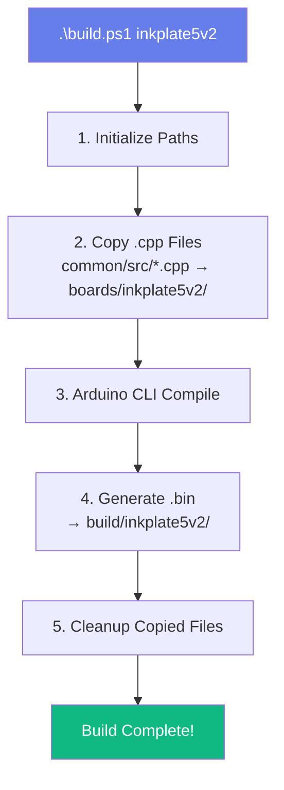
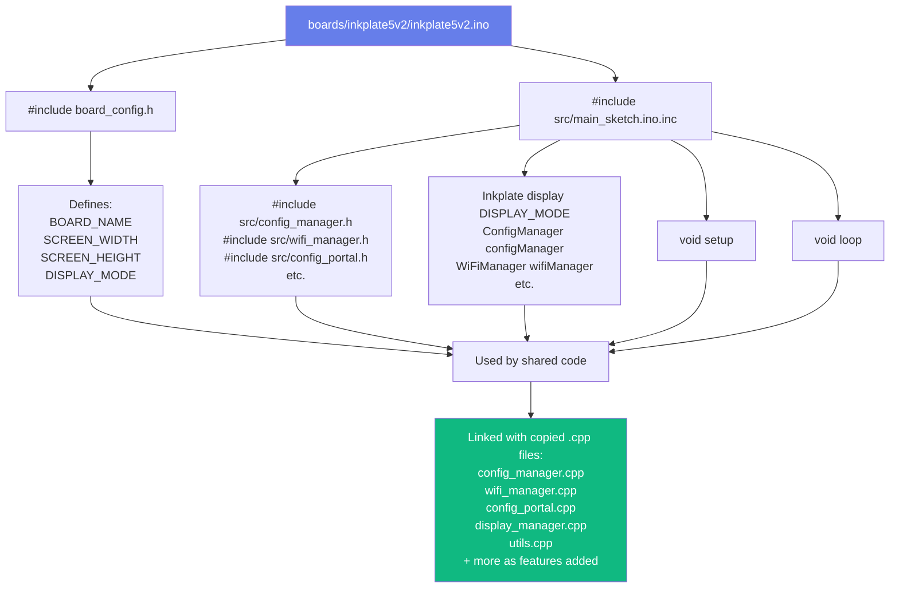
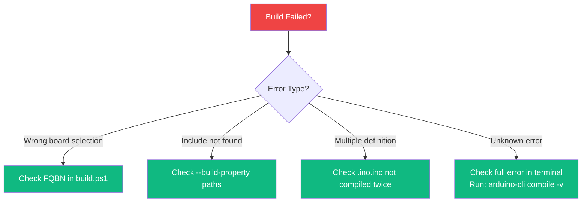

# Architecture Decision Record: Build System Quick Reference

## Status
Accepted

## Context
Contributors need a concise reference for the build system to quickly understand the workflow, commands, and code flow for building firmware for multiple boards.

## Decision
Provide a quick reference guide with visual diagrams and code flowcharts, summarizing the build process and key commands for building and uploading firmware.

## Consequences
- Reduces onboarding time for new contributors.
- Ensures consistent build practices across the team.
- Serves as a handy reference for troubleshooting build issues.

# Build System Quick Reference

## Visual Overview



## Code Flow



## Directory Structure

```
inkplate-dashboard-new/
│
├── 📁 boards/              ← Board-Specific Code (Minimal!)
│   ├── inkplate5v2/
│   │   ├── inkplate5v2.ino       (10 lines - just includes)
│   │   └── board_config.h        (Board constants)
│   └── inkplate10/
│       ├── inkplate10.ino        (10 lines - just includes)
│       └── board_config.h        (Board constants)
│
├── 📁 common/              ← Shared Code (90% of project)
│   ├── library.properties        (Arduino library metadata)
│   ├── 📁 src/
│   │   ├── main_sketch.ino.inc   (Shared setup() & loop())
│   │   ├── config_manager.h/cpp  (Configuration storage)
│   │   ├── wifi_manager.h/cpp    (WiFi AP & client)
│   │   ├── config_portal.h/cpp   (Web interface)
│   │   ├── display_manager.h/cpp (Display abstraction)
│   │   ├── utils.h/cpp           (Utilities)
│   │   ├── config.h              (Global constants)
│   │   └── ...more features...   (Future: image_downloader, png_decoder, etc.)
│   └── 📁 examples/
│       └── *.md                   (Documentation)
│
├── 📁 build/               ← Generated (Git Ignored)
│   ├── inkplate5v2/
│   │   └── *.bin, *.elf, *.map
│   └── inkplate10/
│       └── *.bin, *.elf, *.map
│
├── 📜 build.ps1            ← Main Build Script
├── 📜 upload.ps1           ← Upload Script
├── 📜 setup.ps1            ← Environment Setup
└── 📜 BUILD_SYSTEM.md      ← This Documentation

Note: As features are implemented (image download, PNG decoding, deep sleep, etc.),
      additional .h/.cpp files will be added to common/src/
```

## File Type Guide

| Extension | Purpose | Location | Compiled? |
|-----------|---------|----------|-----------|
| `.ino` | Arduino sketch entry point | `boards/{board}/` | Yes (as .cpp) |
| `.ino.inc` | Shared sketch code | `common/src/` | Yes (via include) |
| `.h` | Header files | `common/src/` | No (included) |
| `.cpp` | Implementation files | `common/src/` | Yes (after copy) |
| `.bin` | Compiled firmware | `build/{board}/` | Final output |
| `.elf` | Debug symbols | `build/{board}/` | Final output |

## Command Cheat Sheet

```bash
# Build Commands
.\build.ps1 inkplate5v2     # Build Inkplate 5 V2
.\build.ps1 inkplate10      # Build Inkplate 10
.\build.ps1 all             # Build all boards

# Upload Commands
.\upload.ps1 -board inkplate5v2 -port COM7
.\upload.ps1 -board inkplate10 -port COM3

# Setup (First Time)
.\setup.ps1                 # Install dependencies

# Cleaning
Remove-Item -Recurse -Force build/
```

## Key Design Decisions

### ✅ Why Copy .cpp Files?

**Problem:** Arduino CLI with `--library` doesn't auto-compile library `.cpp` files  
**Solution:** Temporarily copy to sketch directory  
**Trade-off:** Extra step in build, but maintains clean structure

### ✅ Why .ino.inc Extension?

**Problem:** `.ino` files are auto-compiled separately by Arduino  
**Solution:** Use `.inc` to mark as "include only"  
**Trade-off:** Non-standard, but prevents duplicate symbols

### ✅ Why Not PlatformIO?

**Current:** Arduino CLI with custom scripts  
**Alternative:** PlatformIO has native multi-env support  
**Reason:** Arduino CLI is simpler for this project size, easier for contributors familiar with Arduino ecosystem

### ✅ Why Separate board_config.h?

**Problem:** Different boards need different constants  
**Solution:** Each board has its own config header  
**Benefit:** Shared code adapts automatically via `#define` values

## Build Script Explained (Simplified)

```powershell
# 1. Define board configurations
$boards = @{
    'inkplate5v2' = @{
        Name = "Inkplate 5 V2"
        FQBN = "Inkplate_Boards:esp32:Inkplate5V2"
        Path = "boards/inkplate5v2"
    }
    # ... more boards
}

# 2. Build function
function Build-Board($BoardKey) {
    # a. Copy .cpp files
    Copy-Item common/src/*.cpp → boards/{board}/
    
    # b. Compile
    arduino-cli compile \
        --fqbn {FQBN} \
        --library common \
        --build-property "includes" \
        {sketch-path}
    
    # c. Cleanup
    Remove-Item boards/{board}/*.cpp
}

# 3. Execute build
if ($Board -eq "all") {
    foreach ($board in $boards.Keys) {
        Build-Board $board
    }
} else {
    Build-Board $Board
}
```

## Include Path Resolution

```cpp
// In inkplate5v2.ino:
#include "board_config.h"          // boards/inkplate5v2/board_config.h
#include <src/main_sketch.ino.inc> // common/src/main_sketch.ino.inc

// In main_sketch.ino.inc:
#include <src/config_manager.h>    // common/src/config_manager.h
#include <src/wifi_manager.h>      // common/src/wifi_manager.h
```

**Search Order:**
1. Sketch directory (`boards/inkplate5v2/`)
2. `--library` paths (`common/`)
3. Installed libraries
4. Core libraries

## Memory Layout (Typical)

```
ESP32 Flash (4MB):
├── 0x1000  - Bootloader
├── 0x8000  - Partition Table
├── 0x10000 - Application (your .bin)
├── 0x300000 - NVS (config storage)
└── 0x3F0000 - SPIFFS/LittleFS (optional)
```

## Troubleshooting Decision Tree



## What Happens When You Add New Code

### Adding a New Class

1. Create `common/src/my_class.h` and `common/src/my_class.cpp`
2. Include in `main_sketch.ino.inc`: `#include <src/my_class.h>`
3. Build script automatically copies `.cpp` and compiles it
4. No changes needed to build script!

### Adding a New Board

1. Create `boards/newboard/` directory
2. Create `newboard.ino` (copy from existing, change validation)
3. Create `board_config.h` with board-specific values
4. Add to `$boards` hashtable in `build.ps1`:
   ```powershell
   'newboard' = @{
       Name = "New Board"
       FQBN = "vendor:arch:board"
       Path = "boards/newboard"
   }
   ```
5. Run `.\build.ps1 newboard`

## Performance Metrics

**Typical Build Times (on modern PC):**
- First build (cold): ~30-60 seconds
- Incremental build: ~10-20 seconds
- Build all (2 boards): ~40-80 seconds

**Artifact Sizes:**
- `.bin` file: ~1-2 MB (depends on features)
- `.elf` file: ~3-5 MB (includes debug symbols)

## Further Reading

- Full details: `BUILD_SYSTEM.md`
- Configuration guide: `common/examples/config_portal_guide.md`
- Config manager usage: `common/examples/config_test.md`
- Arduino CLI docs: https://arduino.github.io/arduino-cli/
